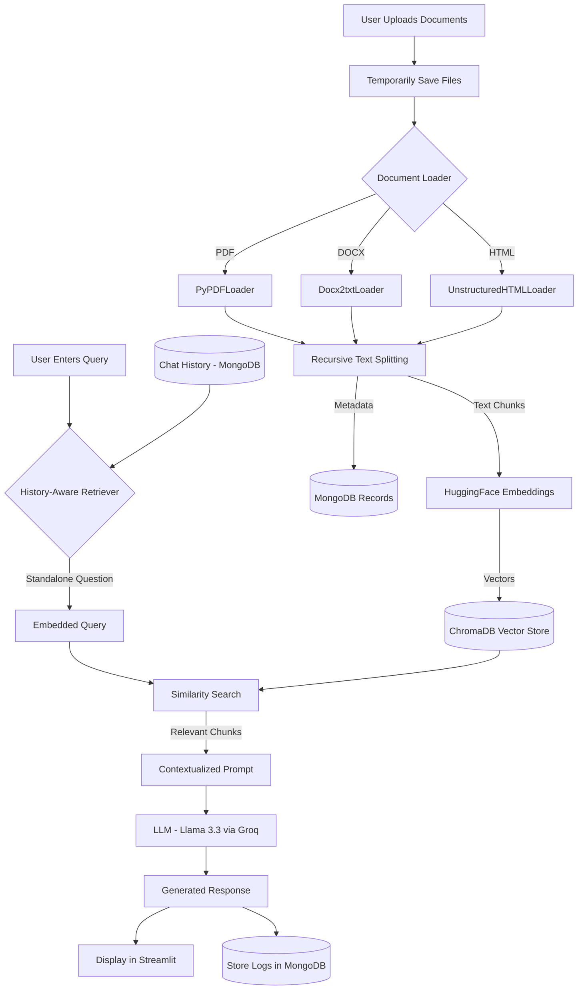

# DocumentIQ: RAG Chatbot

DocumentIQ is a sophisticated Retrieval-Augmented Generation (RAG) chatbot designed to provide intelligent answers based on your own documents. It leverages advanced NLP models and vector databases to deliver accurate, context-aware responses.

## 🚀 Features

- **Multi-Document Support**: Upload and index PDFs, Word documents, and HTML files.
- **RAG-Powered Conversations**: Uses Retrieval-Augmented Generation to ground AI responses in your specific data.
- **Conversational Memory**: Maintains chat history across sessions using MongoDB for context-aware follow-up responses.
- **Interactive UI**: A clean, modern Streamlit interface for seamless user interaction.
- **Hybrid Storage**: Combines MongoDB for chat history & metadata with ChromaDB for high-performance vector search.
- **Scalable Backend**: Powered by FastAPI for robust and efficient API handling.

## 🧩 System Architecture


DocumentIQ implements a high-performance Retrieval-Augmented Generation (RAG) pipeline designed for speed and accuracy.

### 🔄 Architecture Flowchart



### ⚙️ How it Works

1.  **Ingestion & Vectorization**: Uploaded files are chunked into 1000-character segments with overlap. These chunks are embedded using HuggingFace's `all-MiniLM-L6-v2` and stored in **ChromaDB**.
2.  **Conversational Retrieval**: The system is "history-aware." It uses chat logs from **MongoDB** to contextualize user queries, ensuring follow-up questions (e.g., "Why?") are understood correctly.
3.  **High-Speed Generation**: We utilize **Llama 3.3 (70B) on Groq Cloud** for near-instant inference, synthesizing the retrieved context into a clear and accurate final response.

> [!TIP]
> **Hybrid Database Strategy**: We use **ChromaDB** for specialized vector search and **MongoDB** for persistent storage of chat history, file metadata, and conversation logs.


## 🛠️ Technology Stack

- **Frontend**: [Streamlit](https://streamlit.io/)
- **Backend**: [FastAPI](https://fastapi.tiangolo.com/)
- **Orchestration**: [LangChain](https://www.langchain.com/)
- **LLM**: Groq — `llama-3.3-70b-versatile` (via `langchain-groq`)
- **Vector Database**: [ChromaDB](https://www.trychroma.com/)
- **Metadata & Chat History**: [MongoDB](https://www.mongodb.com/)
- **Embeddings**: HuggingFace / Sentence Transformers
- **Document Parsing**: PyPDF, docx2txt, Unstructured

## 📋 Prerequisites

- Python 3.9+
- MongoDB instance (Local or [MongoDB Atlas](https://www.mongodb.com/atlas))
- [Groq API Key](https://console.groq.com/)

## ⚙️ Setup Instructions

### 1. Clone the Repository
```bash
git clone https://github.com/Akshat-777/DocumentIQ-RAG-Chatbot.git
cd DocumentIQ-RAG-Chatbot
```

### 2. Create a Virtual Environment
```bash
cd Chatbot
python -m venv venv
source venv/bin/activate  # On Windows: venv\Scripts\activate
```

### 3. Install Dependencies
```bash
pip install -r requirements.txt
```

### 4. Configure Environment Variables
Create a `.env` file based on the provided template:
```bash
cp .env.example .env
```
Edit `.env` and fill in your credentials:
- `DB_URI`: Your MongoDB connection string.
- `GROQ_API_KEY`: Your Groq API key.
- `DB_NAME`: Database name (default: `rag_chatbot`).
- `API_URL`: Backend URL (default: `http://localhost:8000`).
- `RETRIEVER_K`: Number of chunks to retrieve (default: `5`).
- `LLM_TEMPERATURE`: LLM creativity setting (default: `0.7`).

## 🏃 Running the Application

### Quick Start (Recommended)
From the project root directory, run the startup script that launches both services:
```bash
python run_doc_iq.py
```
- Backend API: http://localhost:8000
- Frontend UI: http://localhost:8501

### Manual Start
If you prefer to run the services separately:

**Terminal 1 — Start the Backend API:**
```bash
cd Chatbot
python -m uvicorn src.main:app --host 127.0.0.1 --port 8000
```

**Terminal 2 — Launch the Streamlit Frontend:**
```bash
cd Chatbot
streamlit run src/streamlit_app.py
```

## ☁️ Deployment

This project includes a native `render.yaml` Blueprint for highly optimized deployment onto the **Render Cloud Network** architecture. The deployment strategies implemented include:
- **Service Discovery**: Seamless internal routing between the FastAPI backend and Streamlit frontend using Render's `hostport` protocol.
- **Resource Constraints**: Implements `MALLOC_ARENA_MAX` glibc tuning and ML chunk micro-batching (25 chunks at a time with manual garbage collection) to smoothly execute NLP models under rigorous free-tier memory constraints (512MB RAM).
- **Automated Sync**: Automatically orchestrates API endpoints safely across public internet boundaries without triggering DDoS rate limits.

## 📂 Project Structure

```
DocumentIQ-RAG-Chatbot/
├── run_doc_iq.py              # One-click startup script
├── README.md
├── Chatbot/
│   ├── .env.example           # Environment variable template
│   ├── requirements.txt       # Python dependencies
│   ├── render.yaml            # Render deployment config
│   ├── data/                  # ChromaDB vector store (auto-generated)
│   └── src/
│       ├── main.py            # FastAPI backend & API endpoints
│       ├── streamlit_app.py   # Streamlit frontend entry point
│       ├── chat_interface.py  # Chat UI component
│       ├── sidebar.py         # Sidebar UI component
│       ├── langchain_utils.py # RAG chain & LLM configuration
│       ├── chroma_utils.py    # ChromaDB vector store operations
│       ├── db_utils.py        # MongoDB database operations
│       ├── api_utils.py       # Frontend API helper functions
│       └── pydantic_models.py # Request/response data models
```


